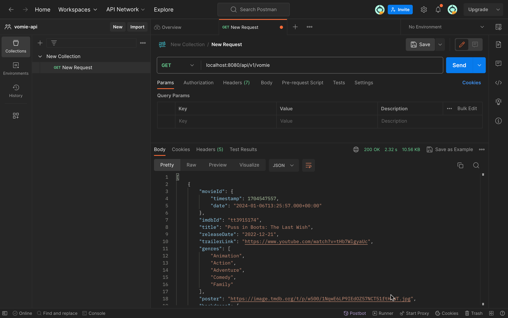

# __Vomie Backend__

<p align="left">


</p>


> Building this to learn Backend with Spring Framwork and MongoDb.

## Table of Content

- [Prerequisite](#prerequisite)
- [Usage](#usage)
    - [Setting Up](#setting-up)
    - [Package Manager](#package-manager)
    - [Enviroment Variables](#enviroment-variables)
    - [Application property](#application-property)
    - [End points](#end-points)

## Prerequisite

To Get started using vomie you'll need to create an account with Mongodb [MongoDb](https://www.mongodb.com/)
create a database clustor and create a database with the collections. within the Movie collection add this json data [Movie data](https://github.com/fhsinchy/movieist/blob/master/_data/movies.json)


### Setting Up

- Use any IDE i'd suggest intellij IDEA

## Package Manager

<details>
<summary>Maven</summary>

- Add dotenv third party configuration dependecy [paulschwarz/spring-dotenv](https://mvnrepository.com/artifact/me.paulschwarz/spring-dotenv).

 </details>

```Maven
<dependency>
	<groupId>me.paulschwarz</groupId>
	<artifactId>spring-dotenv</artifactId>
	<version>2.5.4</version>
</dependency>
```

> Making sure we are configured with MongoDb is very crucial

## Enviroment Variables

```yaml
MONGO-DATABASE= ""
MONGO-USER= ""
MONGO-PASSWORD= ""
MONGO-CLUSTER= ""
```

## Application Property
```yaml
spring.data.mongodb.database=${env.MONGO-DATABASE}

spring.data.mongodb.uri=mongodb+srv://${env.MONGO-USER}:${env.MONGO-PASSWORD}@${env.MONGO-CLUSTER}

```

### End points


- running using localhost:8080
1. api/v1/vomie @GET
    -  get all movies
2. api/v1/vomie/{imdbId} @GET
    - get a movie
3. api/v1/review @POST
    - post a review for a single movie

### postman

| Image                              | Description |
|------------------------------------|-------------|
|  | Get all Movies |
|                | Get single movie|
|             | Send a review on movie |